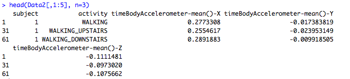

##Code Book
This document describes the code inside run_analysis.R.

The code is divided (by comments) into several sections: 

### variables
1.    fileUrl: the url link to the data file
2.    destf1: destination file name (Dataset.zip)
3.    fs: list of the files in "UCI HAR Dataset" directory.
4.    data_Act_train: data frame containing the Activity train data
5.    data_Act_test: data frame containing the Activity test data
6.    data_Subject_train: data frame containing the Subject train data
7.    data_Subject_test: data frame containing the Subject test data
8.    data_Features_train: data frame containing the Features train data
9.    data_Features_test: data frame containing the Features test data
10.   data_Activity: data frame combines the rows of data_Act_train and data_Act_test
11.   data_Subject: data frame combines the rows of data_Subject_train and data_Subject_test
12.   data_Features: data frame combines the rows of data_Features_train and data_Features_test
13.   Data: the final merged data frame for all data
14.   actLabels: stores descriptive activity names
15.   Data2: subsetted Data for the tidydata set

###Downloading and loading data
	i. 	Download the UCI HAR dataset to “./data/Dataset.zip” called destf1
	ii. Unzip the zip file (destf1)
			Examples: 
				- UCI HAR Dataset/test/X_test.txt
				- UCI HAR Dataset/test/subject_test.txt
				- UCI HAR Dataset/test/y_test.txt
	iii. Read test and train data files
		   a) Read in “Activity” train data file (y_train.txt) to data frame called “data_Act_train”
		   b) Read in “Activity” test data file (y_test.txt) to data frame called “data_Act_test”
		   c) Read in “Subjects” train data file (subject_train.txt) to data frame called “data_Subject_train”
		   d) Read in “Subjects” test data file (subject_test.txt) to data frame called “data_Subject_test”
		   e) Read in “Features” train data file (X_train.txt) to data frame called “data_Features_train”
		   f) Read in “Features” test data file (X_test.txt) to data frame called “data_Features_test”
	iv.	Read the column names of data (features) to a variable called “featureNames”
	v.	Read the activity labels to “actLabels” data frame.
	iv. Merge all the data frames into a big data.frame called (Data) with appropriate column names (feature names + subject + activity)
	
Now, we have a big data.frame called (Data) that includes column names of features, subject, and activity. 

###Manipulating data
	i. 	 Read descriptive activity names from “activity_lables.txt”
	ii.  Factorize variable “activity” in data frame (Data) using descriptive activity names
	iii. Replace Features labels with descriptive variable names
	iv.	 Identify the mean and standard deviation for each measurement 
	iii. Subset the data frame (Data) using the identified columns 
	vi.  Aggregate the data frame (Data)  to calculate the average for each column for each activity/subject pair to data frame called “Data2”.
  

###Writing output data:
	Output data frame (Data2) to a file called “tidydata.txt”.

	
	

	
	